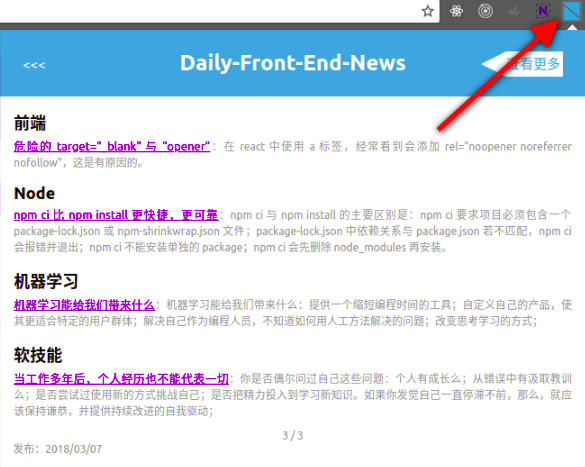

> # chrome-Daily-Front-End-news

数据来源：[Daily-Front-End-News](https://github.com/FengShangWuQi/Daily-Front-End-News)



## 使用

- 去 chrome 网上应用店 [安装](https://chrome.google.com/webstore/detail/front-end-news/dcijaoifeaaafbdglmalaajeedcamogg?utm_source=chrome-app-launcher-info-dialog)

## 开发

- clone 仓库；
- 在 chrome 扩展程序页面勾选 **开发者模式**；
- 点击 **加载已解压的扩展程序**，选择该仓库；
- **调试**：

```
1、点击重新加载 (Ctrl+R) 查看修改；
2、点击背景页调试 background；
3、在 popup 页面右键检查，调试 popup；
```

## F.A.Q

> 点击扩展图标，未正确弹出对应内容，且没有任何错误提示

最早期版本在网速不给力和同一天点击使用多次的情况下可能出现这样的问题，最新版本已经添加了友好的 loading 效果以及对应的错误提示，用户可以在扩展程序页面勾选 **开发者模式**，然后在扩展的详细信息页面点击 **更新** 尝试解决。另外，该扩展目前作者一直在维护，用户可以不定期更新尝试新特性；

---

> 扩展提示错误：OOPS！已超过 rate limit，好消息是可以通过添加 GitHub personal access token 尝试修复

扩展显示的资讯来自 GitHub 仓库，我们通过 GitHub REST API 来获取，GitHub REST API 中有个 **rate limit**，意思是对于没有通过认证的请求，GitHub 限制了它的请求次数，详细可参考 [rate limit](https://developer.github.com/v3/#rate-limiting) 的详细介绍，GitHub 认证有多种方式，在这里，我们一般选择 **自定义 token** 的方案，GitHub 如何生成 token，可参考 [创建 token](https://help.github.com/articles/creating-a-personal-access-token-for-the-command-line/) 的详细介绍，使用该扩展，在生成 token 时可只用勾选一个 public_repo；

## 贡献者
| [<br /><sub>fengshangwuqi</sub>](https://github.com/FengShangWuQi) | [<br /><sub>ihtiht</sub>](https://github.com/ihtiht) |
| :---: | :---: |
