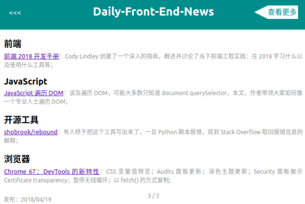

> # chrome-Daily-Front-End-news

数据来源：[Daily-Front-End-News](https://github.com/FengShangWuQi/Daily-Front-End-News)



## 使用

- 去 chrome 网上应用店 [安装](https://chrome.google.com/webstore/detail/front-end-news/dcijaoifeaaafbdglmalaajeedcamogg?utm_source=chrome-app-launcher-info-dialog)

## 开发

- clone 仓库；
- 在 chrome 扩展程序页面点击 **加载已解压的扩展程序**，选择该仓库；
- 调试

```
1、点击重新加载 (Ctrl+R) 查看修改；
2、点击背景页调试 background；
3、在 popup 页面右键检查，调试 popup；
```

## 贡献者
| [<br /><sub>fengshangwuqi</sub>](https://github.com/FengShangWuQi) | [<br /><sub>ihtiht</sub>](https://github.com/ihtiht) |
| :---: | :---: |